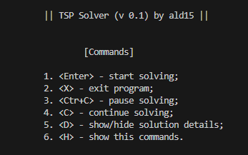
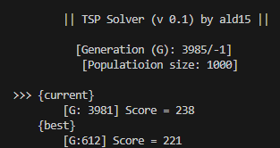
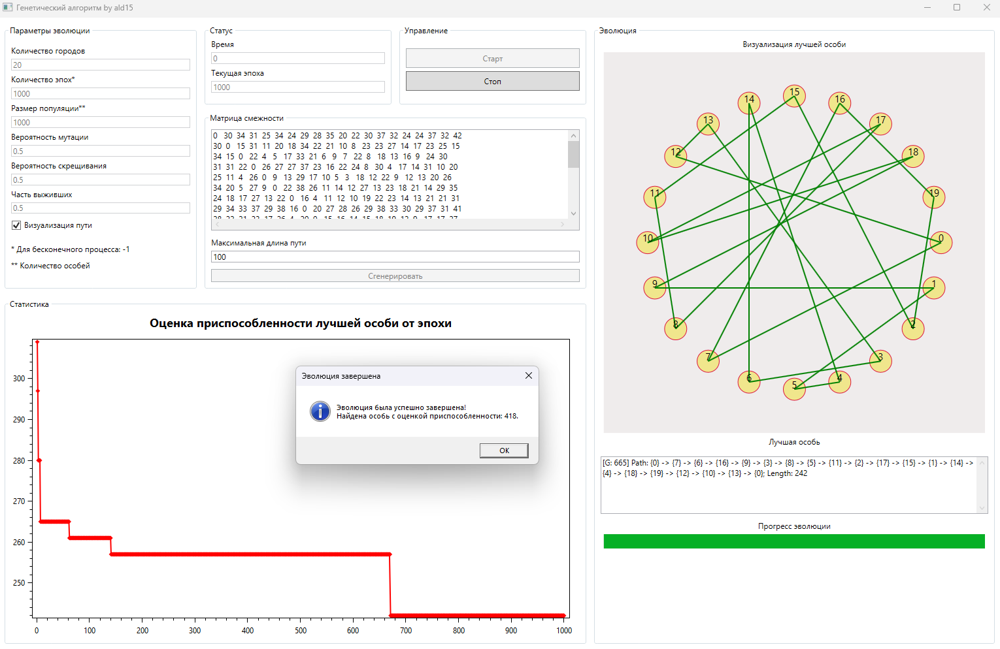
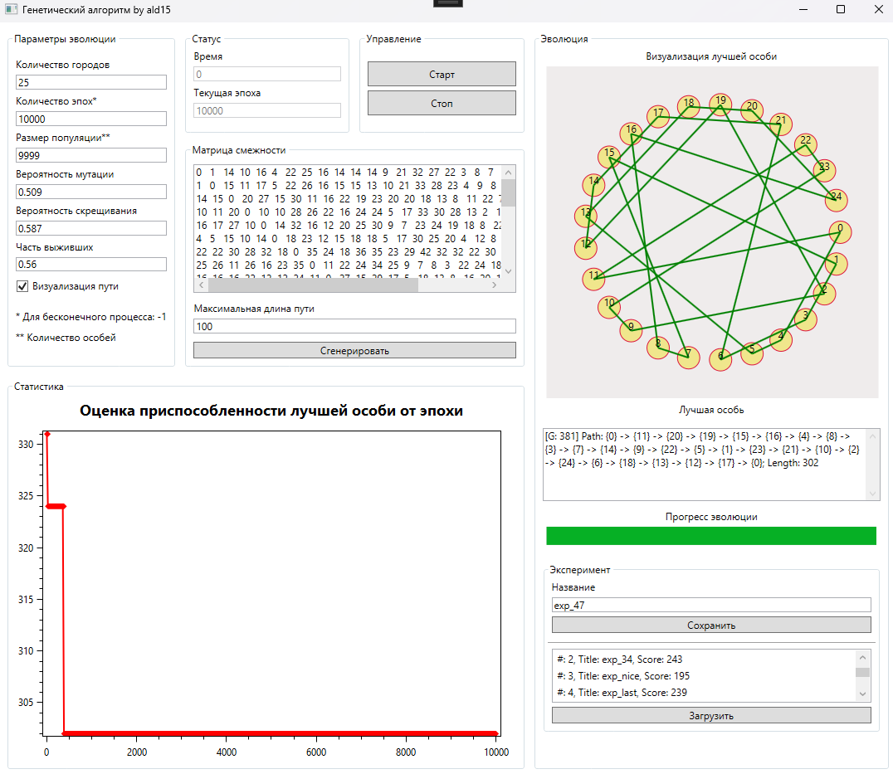

## Описание
- Предмет: Технологическая практика по "Объектно-ориентированное программирование на платформе .NET" осень 2024
- Выполнил: студент 4 курса ВМК МГУ, Дорофеев, 441/2

## Постановка задачи
**Задача коммивояжёра (или TSP от англ. Travelling Salesman Problem)** [[Wiki](https://ru.wikipedia.org/wiki/Задача_коммивояжёра)]
> 

> [!IMPORTANT]
> Задана симметричная квадратная матрица расстояний между $N$ городами $D=\{d_{ij}\}\in R^{N \times N}; \quad d_{ij}=d_{ji}>0; \quad d_{ii}=0$. Требуется найти близкий к кратчайшему маршрут, проходящий по одному разу через все указанные города с возвратом в исходный город. 
>
> В качестве множества решений задачи можно взять множество всех перестановок первых $N$ натуральных чисел. Каждый экземпляр решения определяет порядок посещения городов. Более приспособленным является экземпляр с меньшей длиной маршрута. Мутация - перестановка двух элементов экземпляра.

## Задания
|Задание|Статус выполнения|Статус сдачи|
|:-----:|:---------------:|:----------:|
|[Задание №1](https://github.com/sergey-berezin/dotnet4/blob/master/courses/autumn2024/Task1.md)|✅ 22.09|✅ 22.09
|[Задание №2](https://github.com/sergey-berezin/dotnet4/blob/master/courses/autumn2024/Task2.md)|✅ 27.10|✅ 11.11
|[Задание №3](https://github.com/sergey-berezin/dotnet4/blob/master/courses/autumn2024/Task3.md)|✅ 24.11|✅ 02.12
|[Задание №4](https://github.com/sergey-berezin/dotnet4/blob/master/courses/autumn2024/Task4.md)|✅ -|❌ -

## Задание №1
Выполнено:
- Разработана библиотека классов для решения задачи коммивояжёра методом генетического программирования;
- Библиотека классов размещена в отдельном пакете NuGet: *GeneAlgoPack*;
- Написаны unit-test;
- Написано простое приложение для демонстрации работоспособности библиотеки классов (см. рис. ниже).

## Задание №2
Выполнено:
- Разработано графическое приложение: *WpfApp*;
- В библиотеку классов из задания №1 добавлены многопоточные вычисления;
- Реализовано автоматическое создание матрицы расстояний между городами, удовлетворяющей неравенству треугольника.

## Задание №3
Выполнено:
- Добавлена возможность сохранения всех параметров задачи и актуального состояния популяции после завершения очередных шагов процесса оптимизации (сохраненному эксперименту присваивается имя, которое вводит пользователь).
- Реализована возможность загрузки сохранённых ранее экспериментов и запуска процесс поиска оптимального решения с сохранённого состояния популяции (выбор сохранённого эксперимента выполняется в окне-списке имён экспериментов).
- Для организации постоянного хранилища применяется технология `Entity Framework Core`.

## Лицензия
[GNU General Public License v3.0](https://www.gnu.org/licenses/gpl-3.0.html)
